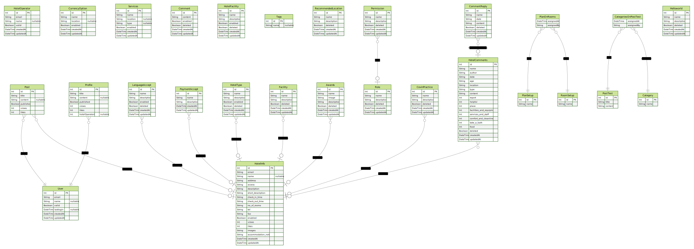

# CMS(restaurant)

### spin up dev environment

```bash
$ ./dev.sh
```

```bash
http://localhost:3002/dashboard
```

# frontend

### spin up dev environment

```bash
npm run docker_rebuild
npm run into_frontend
npm run into_backend

# inside docker

./dev.sh          # if you're running in production./entry.sh
```

### reformat source

```bash
npx nodemon -e "js,jsx" --exec "npm run format"
```

```bash

# landling
http://localhost:3000/hkg/zh-hk

# api test
http://localhost:3000/apiTest

# ask
http://localhost:3000/hkg/zh-hk/ask

# hotel introduction
https://travel.rakuten.com/hkg/zh-hk/hotel_info_item/cnt_japan/sub_okinawa/cty_miyakojima_city/10123456795958
http://localhost:3000/hkg/zh-hk/hotel_info_item/cnt_japan/sub_okinawa/cty_miyakojima_city/10123456795958

```

# backend

### spin up dev environment

```bash
$ ./dev.sh
```

### database reset

```bash
# sync db to schema
npm run db_push

# sync erd
npm run gen_erd

# seed
npm run db_seed
```

# facilities

### ERD



### mail test

http://localhost:8025/

# references

https://blog.logrocket.com/how-to-set-up-node-typescript-express/
